# Introduction

说明：实验室开发环境已经包含优化的全部内容。

实验室桌面文件夹：Java程序设计-软件工程，包含开发所需全部内容。

网课/软件下载网址

https://mooc1-1.chaoxing.com/course/208047689.html

课程基于以下软件及版本：

- Idea Ultimate

- Git

课程及实验代码

https://github.com/bwhyman/java-course

Online tutorial

https://docs.oracle.com/javase/tutorial/index.html

# Installation & Configuration

## Register IntelliJ IDEA

Idea Ultimate，为功能强大的付费版开发工具，但全球学生均可申请免费授权。

中国高校域名email，是受国际承认的正式的学生标识，许多公司(google/apple/amazon等)均为全球在读学生提供各种免费服务。

按国际惯例，邮箱账号为：名缩写+.+姓+数字，账号已被注册，则数字+1。
例如，账号：张小明，x.m.zhang17。Email地址：x.m.zhang17@nefu.edu.cn

联系研究生导师，出国留学申请等，均应使用正式的学生email邮箱

东北林业大学email申请

https://mail.nefu.edu.cn/register/register.jsp

https://mail.nefu.edu.cn/coremail/

 idea学生免费授权计划申请

https://www.jetbrains.com/zh/student/

使用学校email注册idea账号，建议idea账号即为email地址。注册成功后，idea向邮箱发送验证链接，接收到邮件可能有**20分钟的时间延长**


通过链接激活idea账号。Email地址/密码别忘了，在其他电脑登录，比如校实验室，依然需要

## Install IntelliJ IDEA

**卸载，系统中曾经安装过的JDK。idea已集成openjdk，无需安装**

下载idea压缩文件

解压缩ideaIU-X.win.zip(文件名以下载版本为准)，到合适目录。例如，D:\idea


运行D:\idea\bin\idea64.exe，启动idea。

输入学校邮箱创建的idea账号登录，进入welcome页面


## Maven

Maven是当前主流的Java项目构建管理工具

基于Maven的项目依赖管理，maven首先从本地仓库查找依赖，没有则通过网络从远程仓库下载，因此，**第一次添加某依赖时，保持联网状态**

Idea已集成maven插件，但其默认配置不适于开发。因此，通过自定义maven配置，将maven管理的依赖文件下载到指定目录，同时添加阿里镜像，提高下载速度。

在合适目录，创建名为m2目录。例如，D:\m2

在其下创建repository目录，复制或创建maven配置文件settings. xml

**将localRepository节点，修改为自定义的repository目录地址**

```xml
<?xml version="1.0" encoding="UTF-8"?>
<settings xmlns="http://maven.apache.org/SETTINGS/1.1.0" xmlns:xsi="http://www.w3.org/2001/XMLSchema-instance"
          xsi:schemaLocation="http://maven.apache.org/SETTINGS/1.1.0 http://maven.apache.org/xsd/settings-1.1.0.xsd">
    <mirrors>
        <mirror>
            <id>aliyunmaven</id>
            <mirrorOf>*</mirrorOf>
            <name>阿里云公共仓库</name>
            <url>https://maven.aliyun.com/repository/public</url>
        </mirror>
    </mirrors>
    <localRepository>D:/m2/repository</localRepository>

</settings>
```

合适的文件目录结构

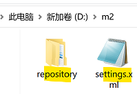

在idea settings中，添加引用配置文件


读取maven setting.xml配置文件，并自动加载声明的本地仓库位置

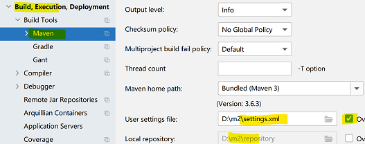


# Optimizing IntelliJ IDEA

在创建工程前，优化idea开发环境


## Code Completion

**关闭**代码提示的大小写匹配，提高开发效率


## Font Size & Style

自定义代码字体样式及尺寸


# Maven Java Project

### Creating Project

在合适位置创建工作区目录，存放课程项目文件。例如，D:\workspace-2020

创建第一个maven项目

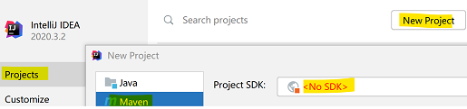

需显式添加JDK，定位到idea\jbr目录

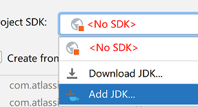


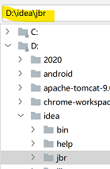


声明项目名称，置于工作区

Maven项目属性说明

Group：开发组织域名反写，确保开发组织的全球唯一性

Artifact：本次开发项目名称，确保开发组织下项目的唯一性，从而确保项目的全球唯一性

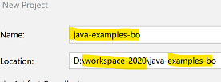

Maven工程结构。其中pom.xml为自动生成的maven项目配置文件

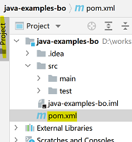

确定，idea已经在pom.xml文件中添加了Java编译运行版本

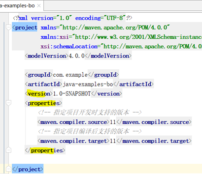

在src/main/java下，创建第一个类

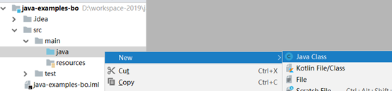

声明类的包路径，com.example，以及类的名称HelloWorld。**区分大小写**

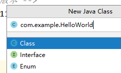

在类中输入以下代码

```java
package com.example;

public class HelloWorld {
    public static void main(String[] args) {
        System.out.println("Hello World");
    }
}
```

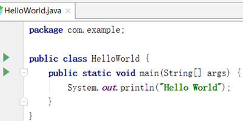

点击main主函数左侧的运行，如果没有运行按钮，确定系统当前用户名为英文

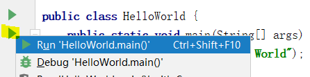

如果没有运行按钮，是因为当前windows用户名为中文

控制台输出打印结果

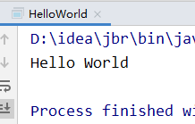


### Closing Project

选择关闭项目，可返回welcome页面。创建或clone新项目

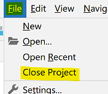

### Deleting Project

在welcome页面点击项目右侧按钮，移除项目

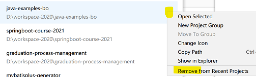

但仅在idea工作区移除了项目，没有在磁盘删除项目

需到工作区手动删除项目目录避免后续项目重名冲突，当然也可在idea中重新打开找回项目

# Version Control

课程全部代码将推送到GitHub，学生需了解并掌握基本git/github的使用方法

## Git

**Git必须安装到英文路径，建议仅更改盘符**

运行安装程序后，除安装地址外，其他选项全部默认

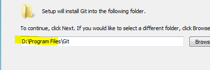

可以取消安装，windows explorer integration下的，git bash here，git GUI here

**不要修改其他所有过程选项，全部默认即可**

安装成功后，可在控制台查看git信息

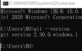

**重启IDEA，IDEA可以自动找到git安装路径**

## GitHub

本门课程不要求学生一定掌握，基于github实现对自己代码本地/远程版本控制的方法(后续课程开始必须掌握)。但强烈建议学生先自行学习了解。

个人github仓库，是找工作/保研/考研，向别人展示自己能力必须提供的证明

## Cloning Remote Project

为便于学习，课程通过创建一个项目(project)，在项目中创建若干模块(module)实现。因此，仅需从github clone一次项目，每次拉取更新即可。

可以在此项目中创建自己的学习测试module，不会影响到课程代码

**确定系统已安装git**

返回welcome页面。选择获取远程项目

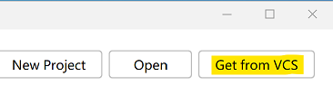

定位到工作区，复制课程仓库地址。idea将自动创建项目目录，clone项目到工作区目录

https://github.com/bwhyman/java-course

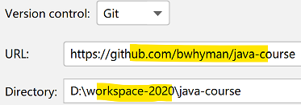

打开左侧project视图，clone下的项目与开发时的项目完全相同

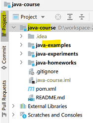

### Updating Remote Peoject

课程代码更新后会推送到github，，需更新项目拉取最新的代码

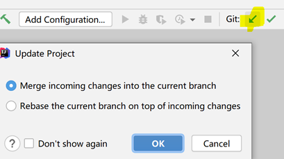

### Create New Module

可以在此项目中创建自己的学习测试module

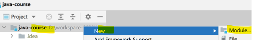

基本maven module

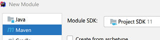

模块名称不能冲突，可以以用户名命名。自动在项目下创建同名目录

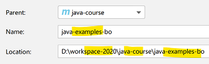

### Delete Module

在项目中删除不需要的module

为防止误操作，idea禁止直接删除项目中的模块。需要先将模块从项目移除，此时模块所有文件均没有从磁盘删除，还可重新导入

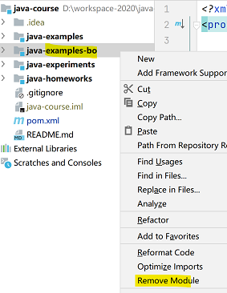

再次，从磁盘删除

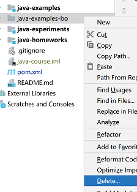

打开项目pom.xml配置，其中模块声明没有被自动删除。手动删除即可

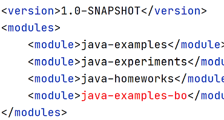