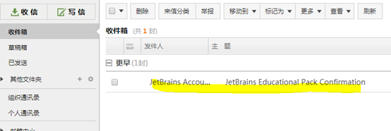
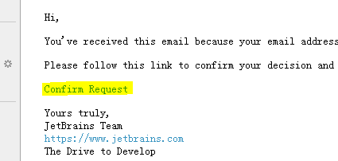
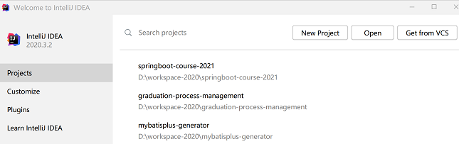
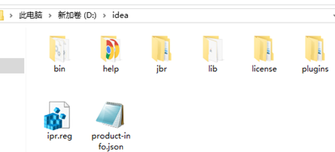
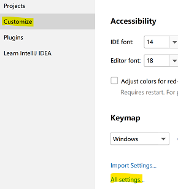
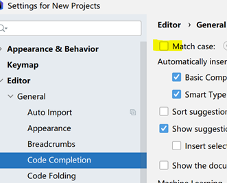
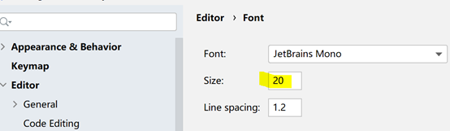

# Prerequisites

教学群/学习通资源，下载2个文件准备。ideaIU-X.win.zip，settings.xml。  

不要着急运行idea，按以下步骤配置！~

# Maven & Settings

[视频：Maven](https://mooc1.chaoxing.com/nodedetailcontroller/visitnodedetail?courseId=217339173&knowledgeId=416968558)

[视频：Maven的本地配置](https://mooc1.chaoxing.com/nodedetailcontroller/visitnodedetail?courseId=217339173&knowledgeId=726850150)

# IntelliJ IDEA
**卸载系统中曾经安装过的Oracle JDK。idea已集成openjdk，无需安装**

有以下两种idea激活方法：通过校邮箱申请免费授权，破解激活

## Free Educational Licenses
Idea Ultimate，为功能强大的付费版开发工具，但全球学生均可申请免费授权。

中国高校域名email，是受国际承认的正式的学生标识，许多公司(google/apple/amazon等)均为全球在读学生提供各种免费服务。

按国际惯例，邮箱账号为：名缩写+.+姓+数字，账号已被注册，则数字+1。
例如，账号：张小明，x.m.zhang17。Email地址：x.m.zhang17@nefu.edu.cn

或直接使用学号申请，例如：2018214270@nefu.edu.cn

联系研究生导师，出国留学申请等，均应使用正式的学生email邮箱

东北林业大学email申请

https://mail.nefu.edu.cn/register/register.jsp

https://mail.nefu.edu.cn/coremail/

 idea学生免费授权计划申请

https://www.jetbrains.com/shop/eform/students

使用学校email注册idea账号，建议idea账号即为email地址。注册成功后，idea向邮箱发送验证链接，接收到邮件可能有**20分钟的时间延长**

输入学校邮箱创建的idea账号登录，进入welcome页面

## 基于学信网申请IDEA Ultimate授权
如学校信箱始终无法收到认证信息，可使用国家学信网信息申请。[详细方法](./student_register.md)

## IDEA Crack
如学校信箱，学信网信箱均无法获取授权，教学群下载ja-netfilter-all.zip。解压到合适目录，按激活方法破解激活

## Unzip IDEA
解压缩ideaIU-X.win.zip(文件名以下载版本为准)，到合适目录。例如，D:\idea

运行D:\idea\bin\idea64.exe，启动idea。

# IDEA Maven Settings

[视频：IDEA引入maven settings配置](https://mooc1.chaoxing.com/nodedetailcontroller/visitnodedetail?courseId=217339173&knowledgeId=726862579)

# Maven Java Project

[视频：IDEA创建maven java project](https://mooc1.chaoxing.com/nodedetailcontroller/visitnodedetail?courseId=217339173&knowledgeId=416970143)

# Optimizing IntelliJ IDEA
优化idea开发环境

## Code Completion

**关闭**代码提示的大小写匹配，提高开发效率

## Font Size & Style

自定义代码字体样式及尺寸

