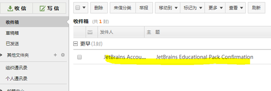
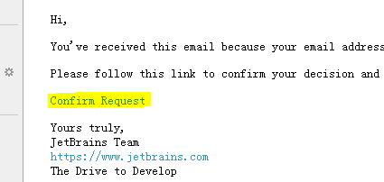
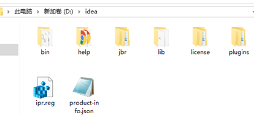
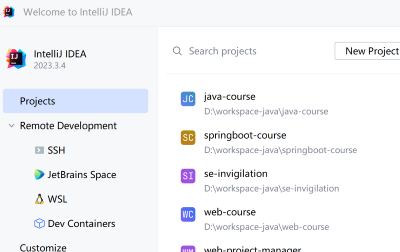
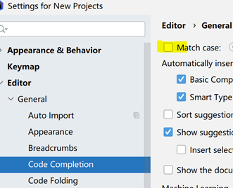
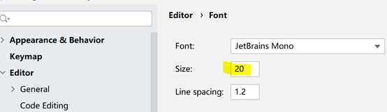

# Prerequisites

按教学群要求，下载2个文件准备。idea-XXX.zip，settings.xml。

不要着急运行idea，先按以下步骤配置Maven，申请idea授权！~

# Maven & Settings

[视频：Maven](https://mooc1.chaoxing.com/nodedetailcontroller/visitnodedetail?courseId=217339173&knowledgeId=416968558)

[视频：Maven的本地配置](https://mooc1.chaoxing.com/nodedetailcontroller/visitnodedetail?courseId=217339173&knowledgeId=726850150)

# IntelliJ IDEA

**卸载系统中安装过的JDK，移除设置的系统环境变量java_home。idea已集成openjdk，无需安装**

IDEA Ultimate是功能强大的付费版开发工具，但全球学生均可申请免费授权。

通过以下两种方式之一申请idea免费授权：校邮箱，学信网。  

### Free IDEA Educational Licenses

中国高校域名邮箱`@edu.cn`，是受国际承认的正式的学生标识，许多公司(google/apple/amazon等)均为全球在读学生提供各种免费服务。

按国际惯例，邮箱账号为：名缩写+.+姓+数字，账号已被注册，则数字+1。
例如，账号：张小明，x.m.zhang17。Email地址：x.m.zhang17@nefu.edu.cn

或直接使用学号申请，例如：2018214270@nefu.edu.cn

联系研究生导师，出国留学申请等，均应使用正式的学生email邮箱

东北林业大学email申请

https://mail.nefu.edu.cn/coremail/

 idea学生免费授权计划申请

https://www.jetbrains.com/shop/eform/students

idea向邮箱发送验证链接，接收到邮件可能有**20分钟的时间延迟**

通过以下网址使用学校email激活idea账号。由于是首次激活登录，idea会再次向email邮箱发送一个6位数的验证码，确保激活用户对该邮箱，也有几分钟延迟。再，设置创建登录密码。

[https://account.jetbrains.com/login](https://account.jetbrains.com/login)

### 基于学信网申请IDEA Ultimate授权

如学校邮箱始终无法收到认证信息，可使用国家学信网信息申请。[详细方法](./student_register.md)

### IDEA Crack

如学校邮箱学信网信箱均无法获取授权，找授课教师提供指导方案。

### Unzip IDEA

解压缩ideaIU-X.win.zip(文件名以下载版本为准)，到合适目录。例如，D:\idea

运行D:\idea\bin\idea64.exe，启动idea。同时右键点击文件，创建桌面快捷键。  

输入学校邮箱创建的idea账号登录，进入welcome页面

**先不要创建项目，完成以下配置！~**

# IDEA Maven Settings

[视频：IDEA引入maven settings配置](https://mooc1.chaoxing.com/nodedetailcontroller/visitnodedetail?courseId=217339173&knowledgeId=726862579)

# Maven Java Project

[视频：IDEA创建maven java project](https://mooc1.chaoxing.com/nodedetailcontroller/visitnodedetail?courseId=217339173&knowledgeId=416970143)

# Optimizing IntelliJ IDEA

### Disabled AI Suggestions

保留代码提示，但关闭AI提示。关闭以下设置

settings--Editor--general--inline Completion--Enable local full completion suggestions

优化idea开发环境

### Code Completion

**关闭**代码提示的大小写匹配，提高开发效率

### Font Size & Style

自定义代码字体样式及尺寸

