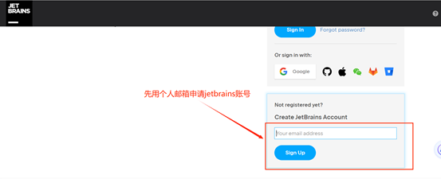
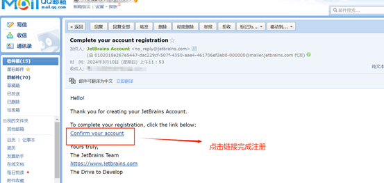
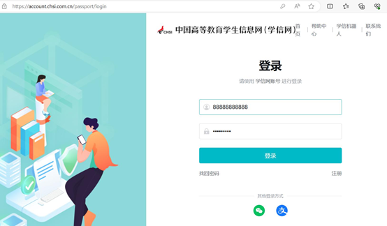
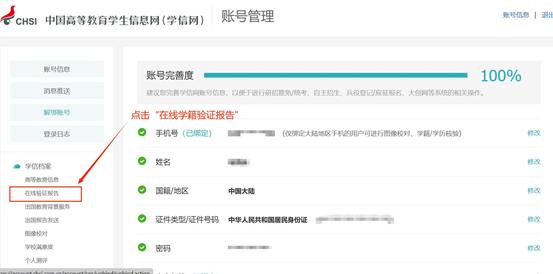
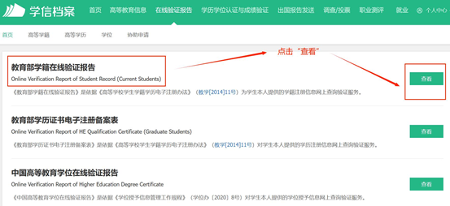
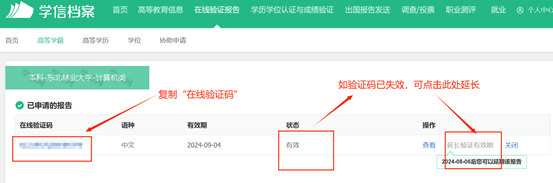
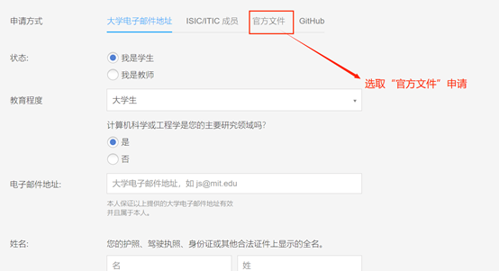
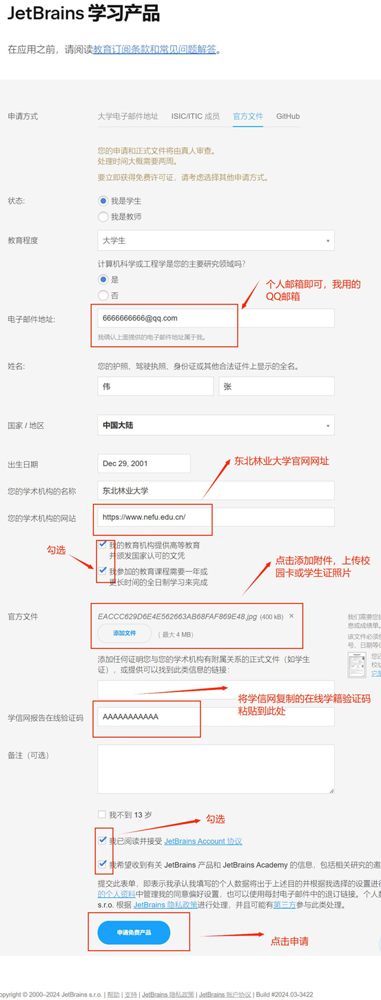
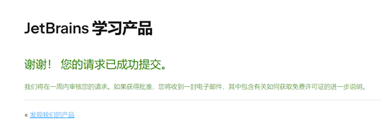
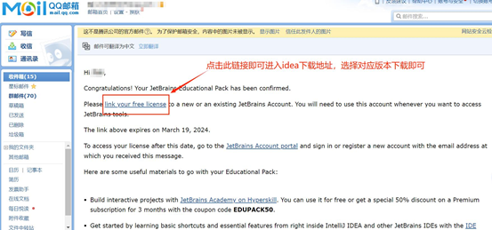

# 基于学信网申请IDEA Ultimate授权

如果通过学校信箱无法申请到IDEA授权，例如始终无法收到认证email，可尝试通过国家学信网信息申请。

***由22级软件一班马凯航同学整理***

在学校信箱无效时使用QQ等信箱创建创建账户。 [JetBrains Account](https://account.jetbrains.com/login)

收到邮件后激活账号，此时为普通账号，无法使用学生Ultimate授权

登录学信网，获取国家学生学籍在线认证报告。[登录_学信网](https://account.chsi.com.cn/passport/login)

申请IDEA学生授权。[JetBrains 学习产品](https://www.jetbrains.com/shop/eform/students)

IDEA人工审核，不会立马回复邮件，**需要等几天**

非学校信箱收到IDEA认证，点击激活后，登录使用IDEA Ultimate版。

